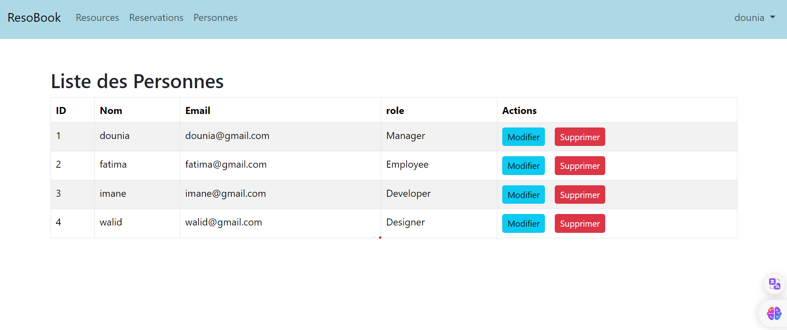

<H3>Microservices Reservation </H3>
On souhaite créer une application basée sur une architecture micro-service qui permet de gérer des réservations concernant des ressources. Chaque réservation concerne une seule ressource. Une ressource est définie par son id, son nom, son type (MATERIEL_INF0, MATERIEL_AUDIO_VUSUEL). Une réservation est définie par son id, son nom, son contexte, sa date, sa durée. Chaque réservation est effectuée par une personne. Une personne est définie par son id, son nom, son email et sa fonction. 
#cette application se composera de deux micro-services fonctionnels :

1. Un Micro-service qui permet de gérer des « Resources-Service ».

2. Un Micro-service qui permet de gérer les réservations effectuées par des personnes. 
#Les micro-services technique à mettre en place sont :

. Le service Gateway basé sur Spring cloud Gateway

. Le service Discovery base sur Eureka Server ou Consul Discovery (au choix)

. Le service de configuration basé sur Spring cloud config ou Consul Config (au choix)

